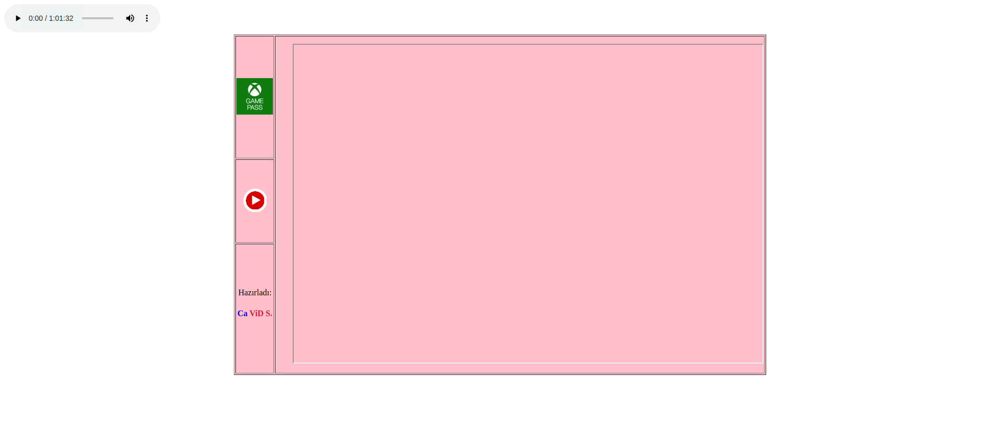
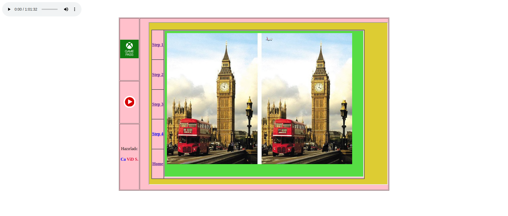
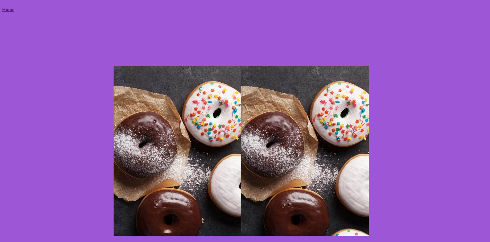
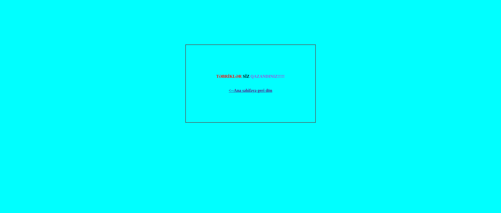
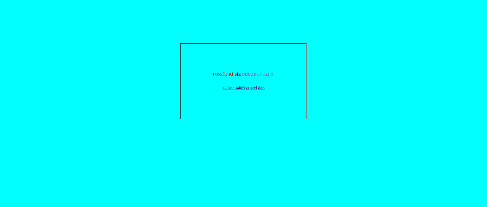

# GITHUB GÖSTƏRİCİLƏRİ

# FIND-THE-DIFFERENCE-BETWEEN-TWO-PICTURES

Salam xoş gördük bu dərsimizdə HTML-5 istifadə edərək **FIND-THE-DIFFERENCE-BETWEEN-TWO-PICTURES** düzəltməyi test etdik. Yazdığımız kodları və alınan nəticəni analiz etmək üçün aşağıdakı addımları izləyə bilərsiniz
  **HTML** vasitəsilə hazırlanmış **"Şəkillər arasındakı fərqi tap oyunu"**
>Burada **iframe**, **table**, **audio**, **map**, **area**, **a** teqlərindən istifadə etməklə 5 dənə tap (1,2,3,4,5) html faylı yaratdım və daha sonra şəkillərdəki fərqi **map** və **area** teqləri vasitəsilə koordinant verdim. Daha sonra tap1, tap2, tap3, tap4 və tap5 html faylarını **a** teqi vasitəsilə **href** atributuna link verərək birləşdirdim. Oyunun əvvəlindən **audio** teqindən istifadə edərək **autoplay** atributu vasitəsilə görünməz bir oyun səsi verdim.

## İSTİFADƏ QAYDASI

> **ADDIM-1:**   `git clone https://github.com/cavidsuleyman/FIND-THE-DIFFERENCE-BETWEEN-TWO-PICTURES.git`  
> **ADDİM-2:**  yaranan `FIND-THE-DIFFERENCE-BETWEEN-TWO-PICTURES` qovluğuna daxil olun  
> **ADDİM-3:**  içərisində olduğunuz qovluğu mətn redaktorunda açın  
> **ADDİM-4:**  ana qovluqda olan `index.html` fayılını işə salın  
> **ADDİM-5:**  projecti `.zip` olaraq yükləmək üçün  [buraya](https://github.com/cavidsuleyman/FIND-THE-DIFFERENCE-BETWEEN-TWO-PICTURES/archive/refs/heads/master.zip) click edin  

## TEXNOLOGİYA

Bu layihə aşağıdakı texnologiyalar istifadə edilərək hazırlanıb

|No|Texnika   |Təyinatı                                       |
|--|----------|-----------------------------------------------|
|1 |HTML      |Layihə skletinin qurulması                     | 
|2 |GİT       |Layihənin versiya kontrolunun idarə olunması   |
|3 |VSCode    |Layihədə istifadə edilən mətn redaktoru        |

## NÜMUNƏ EKRAN GÖRÜNTÜSÜ

